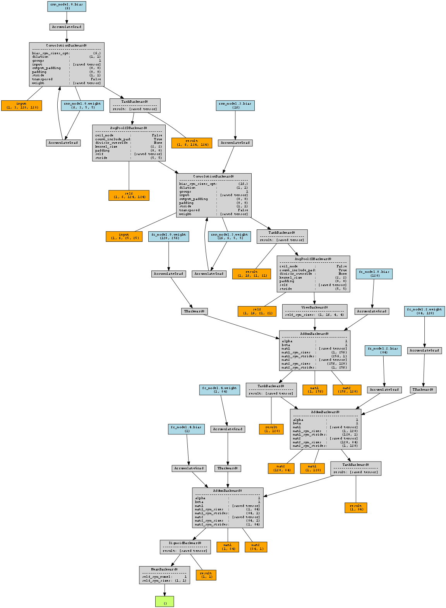

## Problem Description
This project aims to use machine learning classification to determine which brain scan images have tumors present and which ones do not. 

I used this [dataset](https://www.kaggle.com/datasets/navoneel/brain-mri-images-for-brain-tumor-detection/data ":)") from kaggle and this [playlist](https://www.youtube.com/watch?v=CiW8gS7kqOY&list=PL5foUFuneQnratPPuucpVxWl4RlqueP1u "=)") from youtube.

## Neural Network Diagram

