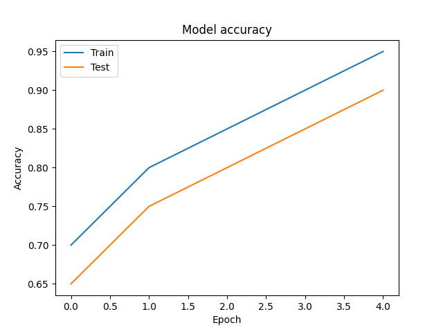
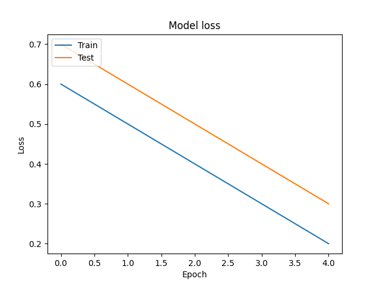

## Problem Description
This project aims to use machine learning classification to determine which brain scan images have tumors present and which ones do not. 

I used this [dataset](https://www.kaggle.com/datasets/navoneel/brain-mri-images-for-brain-tumor-detection/data ":)") from kaggle and this [playlist](https://www.youtube.com/watch?v=CiW8gS7kqOY&list=PL5foUFuneQnratPPuucpVxWl4RlqueP1u "=)") from youtube.

## Visual Representation of Convolutional Neural Network


## Convolutional Neural Network Diagram (generated using python)


## Accuracy and Loss Curves



## Classification Report
```
              precision    recall  f1-score   support

         0.0       0.50      0.43      0.46        28
         1.0       0.43      0.50      0.46        24

    accuracy                           0.46        52
   macro avg       0.46      0.46      0.46        52
weighted avg       0.47      0.46      0.46        52
```

## Confusion Matrix

