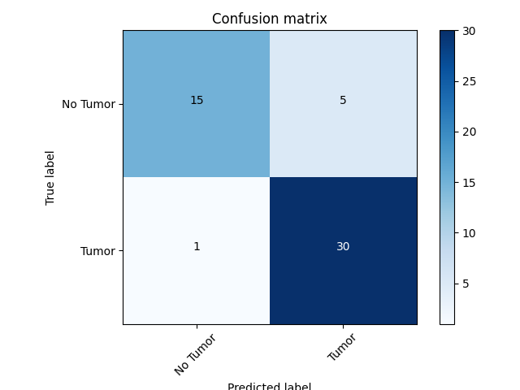

## Problem Description
This project aims to use machine learning classification to determine which brain scan images have tumors present and which ones do not. 

I used this [dataset](https://www.kaggle.com/datasets/navoneel/brain-mri-images-for-brain-tumor-detection/data ":)") from kaggle.

## Visual Representation of Convolutional Neural Network


## Convolutional Neural Network Diagram (generated using python, keras, tensorflow)


## Model Summary
```
Model: "functional_1"
┏━━━━━━━━━━━━━━━━━━━━━━━━━━━━━━━━━━━━━━┳━━━━━━━━━━━━━━━━━━━━━━━━━━━━━┳━━━━━━━━━━━━━━━━━┓
┃ Layer (type)                         ┃ Output Shape                ┃         Param # ┃
┡━━━━━━━━━━━━━━━━━━━━━━━━━━━━━━━━━━━━━━╇━━━━━━━━━━━━━━━━━━━━━━━━━━━━━╇━━━━━━━━━━━━━━━━━┩
│ input_layer_3 (InputLayer)           │ (None, 128, 128, 3)         │               0 │
├──────────────────────────────────────┼─────────────────────────────┼─────────────────┤
│ vgg16 (Functional)                   │ (None, 4, 4, 512)           │      14,714,688 │
├──────────────────────────────────────┼─────────────────────────────┼─────────────────┤
│ flatten_1 (Flatten)                  │ (None, 8192)                │               0 │
├──────────────────────────────────────┼─────────────────────────────┼─────────────────┤
│ dense_2 (Dense)                      │ (None, 256)                 │       2,097,408 │
├──────────────────────────────────────┼─────────────────────────────┼─────────────────┤
│ dropout_1 (Dropout)                  │ (None, 256)                 │               0 │
├──────────────────────────────────────┼─────────────────────────────┼─────────────────┤
│ dense_3 (Dense)                      │ (None, 2)                   │             514 │
└──────────────────────────────────────┴─────────────────────────────┴─────────────────┘
 Total params: 21,008,456 (80.14 MB)
 Trainable params: 2,097,922 (8.00 MB)
 Non-trainable params: 14,714,688 (56.13 MB)
 Optimizer params: 4,195,846 (16.01 MB)
```

## Classification Report
```
Classification Report:
               precision    recall  f1-score   support

           0       0.82      0.90      0.86        20
           1       0.93      0.87      0.90        31

    accuracy                           0.88        51
   macro avg       0.87      0.89      0.88        51
weighted avg       0.89      0.88      0.88        51
```

## Accuracy and Loss Curves


## Confusion Matrix


## ROC Curve


